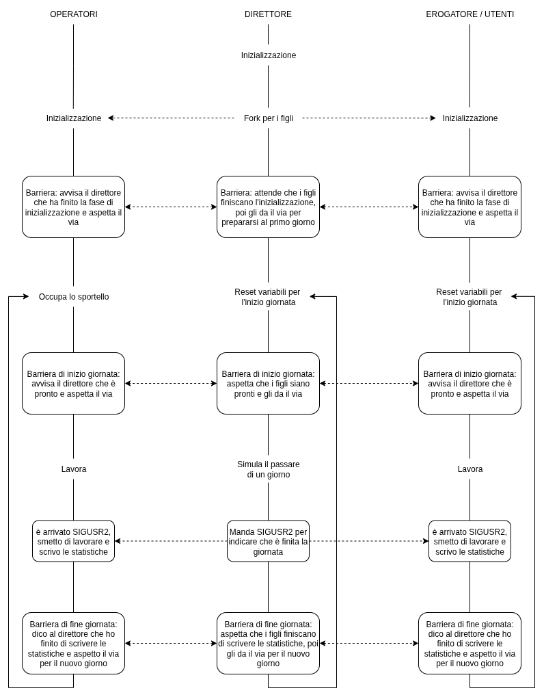

# Relazione Progetto di Sistemi Operativi
## Anno Accademico 2024/2025  
**Simulazione di un Ufficio Postale**

**Componenti del gruppo:**  
- Saracino Matteo, matricola: 1102302, matteo.saracino@edu.unito.it  
- Trapani  Davide, matricola: 1102730, davide.trapani602@edu.unito.it  

---

### Traccia e Obiettivi
Il progetto consiste nella simulazione del funzionamento di un **ufficio postale** tramite processi paralleli che si scambiano informazioni e risorse secondo specifici requisiti.
I principali obiettivi sono:
- Realizzare diversi processi (direttore, operatori, utenti, erogatore di ticket) che interagiscono tra loro sfruttando semafori, memoria condivisa, code di messaggi, segnali.
- Gestire sportelli specializzati e assegnazione dei servizi.
- Mantenere e calcolare statistiche dettagliate sul lavoro svolto.

---

### Scelte Progettuali

    

Diagramma di flusso per visualizzare la gestione delle giornate tramite le barriere.
Nella nostra interpretazione, gli operatori occupano gli sportelli prima dell'inizio della giornata: abbiamo immaginato che, come nella realtà, arrivino qualche minuto prima dell'apertura, così da essere pronti per l'inizio della giornata (motivo per il quale abbiamo introdotto la barriera sia a inzio che a fine giornata).

---

### Semafori
Per creare alcuni punti di sincronizzazione e per permettere ai vari processi di accedere alle risorse in modo corretto e concorrenziale, abbiamo creato un set di semafori formato da 6 semafori.

Per la sincronizzazione tra il direttore e i processi figli abbiamo implementato una barriera usando **due semafori**:
- Il primo semaforo: consente ai figli di segnalare al direttore, prima che inizi la simulazione o una volta terminata la giornata, che hanno finito di eseguire le loro azioni e che sono in attesa che il direttore dia il via per il giorno successivo o la terminazione della simulazione.

- Il secondo semaforo: consente al direttore di segnalare ai figli che possono riprendere con la simulazione, ovviamente prima di questo punto di sincronizzazione il direttore si occupa di preparare tutto ciò che è necessario per riprendere la simulazione.

Per la gestione e l'accesso in modo esclusivo alle risorse in punti critici abbiamo implementato altri **quattro semafori**:
- Il terzo semaforo: consente sia di velocizzare la gestione degli sportelli segnando quanti sportelli sono liberi, in modo tale da non dover necessariamente accedere alla memoria condivisa per verificare la disponibilità; oppure per far aspettare gli operatori che stanno aspettando che si liberi uno sportello. 

- Il quarto semaforo: serve per l'accesso di un singolo operarore nella procedura di occupazione di uno sportello, essendo in memoria condivisa è necessario l'utilizzo di un lock.

- Il quinto semaforo: serve per l'accesso singolo di ogni processo figlio del direttore a fine giornata per l'aggiornamento delle statistiche che vengono calcolate e aggiornate, essendo in memoria condivisa è necessario l'utilizzo di un lock.

- Il sesto semaforo: serve per far attendere la fine giornata ai processi figli che finiscono le loro azioni prima del direttore
---
### Segnali
Sono stati utilizzati due segnali principali:
- **SIGUSR2**: indica la fine della giornata lavorativa.
- **SIGTERM**: termina la simulazione completamente.

Ogni processo dispone di un handler per la gestione di questi segnali che alterano il normale flusso di esecuzione modificando variabili globali, interrompendo il lavoro per concludere la giornata o la simulazione.

---
### Code di Messaggi 
Le principali comunicazioni tra processi avvengono tramite code di messaggi:
- **Richiesta ticket**: utente → erogatore
- **Assegnazione ticket**: erogatore → operatori
- **Risposta erogazione**: operatori → utenti
- **Aggiunta nuovi utenti**: terminale → direttore

Le code vengono create dal direttore e gli ID vengono trasmessi come parametri ai figli durante la creazione. Le code vengono poi cancellate al termine della simulazione sempre dal direttore dopo che tutti i figli sono terminati.

---
### Memoria Condivisa
Gestisce:
- Assegnazione degli sportelli agli operatori.
- Raccolta delle statistiche.

Gli sportelli sono in memoria condivisa e ogni operatore ci accede per provare ad occupare uno sportello che sia consono al servizio che offre, altrimenti attende. Il ripristino degli sportelli da parte del direttore viene effettuato prima dell'inizio della simulazione e nel punto di sincronizzazione tra una giornata e l'altra.

Anche le statistiche sono memorizzate in memoria condivisa. Ogni processo escluso il direttore, ha dei contatori locali che ci permettono di aggiornare e accedere alla memoria solo alla fine di ogni giornata. Ci accede un processo alla volta, diminuendo gli accessi e quindi anche i rallentamenti durante la simulazione, ma sopratutto massimizzando la concorrenza tra processi.

---

### Simulazione di una Giornata
La simulazione temporale usa due costanti configurabili:
- Durata di un minuto simulato (in nanosecondi).
- Numero di minuti di una giornata.

Il tempo è simulato tramite una chiamata `nanosleep`, con la durata effettiva della giornata lavorativa.
Inoltre grazie al file di configurazione è possibile variare i parametri :
- Numero degli operatori
- Numero degli utenti giornalieri
- Numero degli sportelli
- Numero massimo delle pause effettuate dagli operatori (hanno il 30% di possibiltià di andare in pausa e devono aver erogato almeno 2 servizi)
- Numero massimo delle richieste che ogni utente può fare ogni giorno
- Probabilità minima che l'utente non si presenti all'ufficio postale
- Probabilità massima che l'utente non si presenti all'ufficio postale
- Numero di minuti simulati per ogni giornata
- Numero di nanosecondi che compongono un minuto della simulazione (il prodotto di queste due ultime variabili non può avere un valore che supera il dominio del tipo `int`)

### Terminazione della Simulazione
La simulazione termina:
- Al raggiungimento del timeout (durata configurata).
- Quando il numero di utenti in attesa supera una soglia (explode threshold).

Le cause di terminazione sono sempre riportate nell’output, insieme alle statistiche finali. I parametri sono modificabili dai file di configurazione dedicati.

---

### Conclusioni
La simulazione offre una panoramica completa sulla gestione concorrente di processi, sincronizzazione e comunicazione tra più entità, secondo la traccia assegnata e le scelte progettuali discusse.